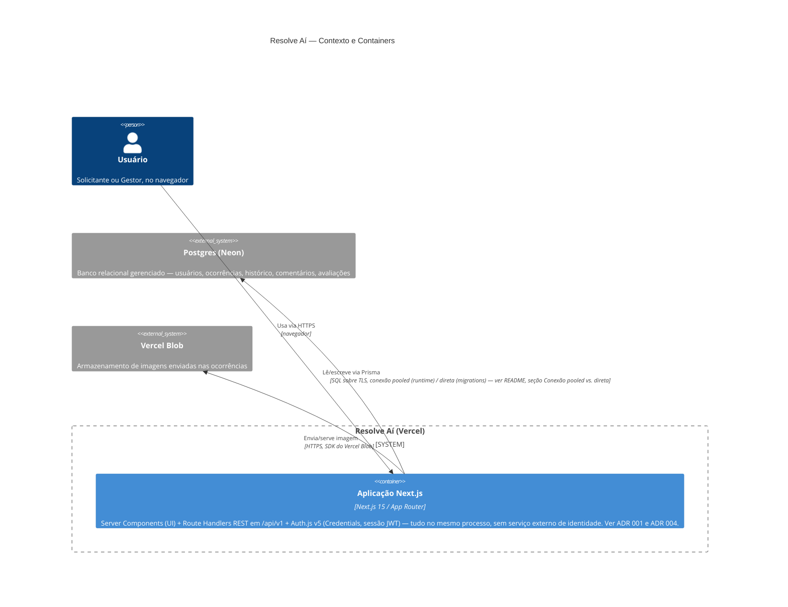
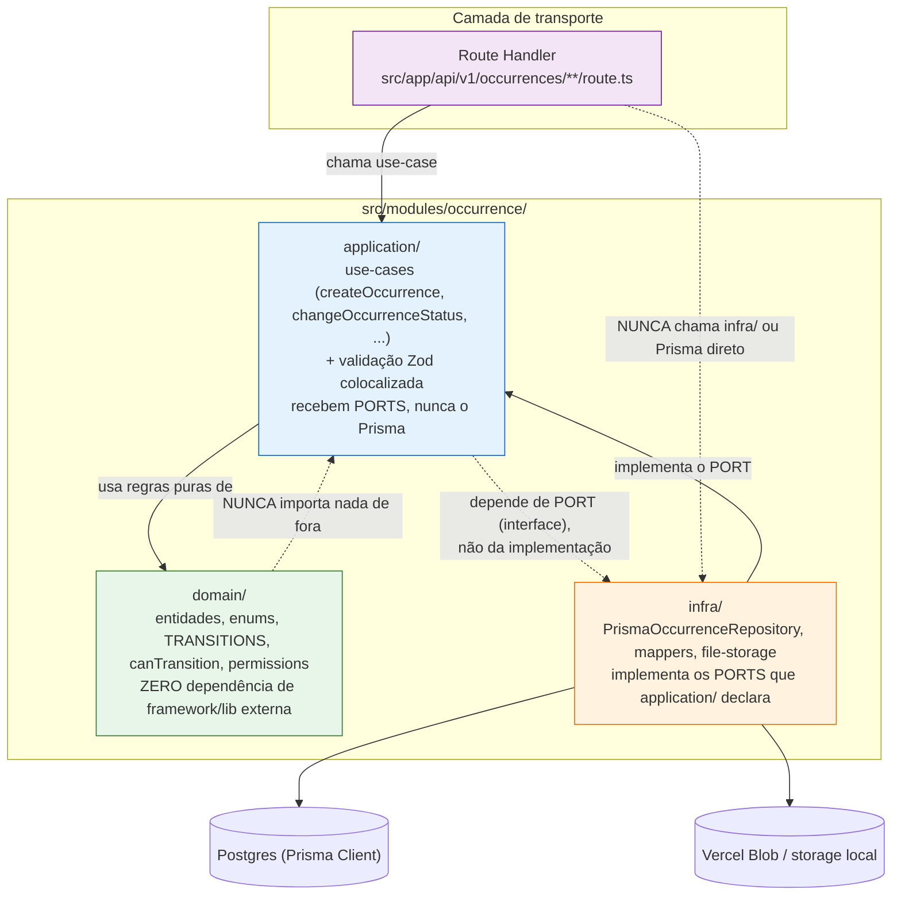

# Arquitetura — Resolve Aí

Este documento cobre dois níveis, deliberadamente separados:

1. **Contexto/container (C4)** — quem usa o sistema e com quais serviços externos ele
   conversa em produção.
2. **Camadas dentro da aplicação** — como o código é organizado por dentro de um módulo
   (`domain` → `application` → `infra`), e onde a camada de transporte (`Route Handler`)
   se encaixa.

As decisões que sustentam estes diagramas estão registradas em `docs/adr/`:
[001](./adr/001-nextjs-fullstack.md) (fullstack, não Next+NestJS separado),
[002](./adr/002-postgres-prisma.md) (Postgres+Prisma), [004](./adr/004-auth-js-credentials.md)
(Auth.js), [005](./adr/005-historico-transacional.md) (histórico transacional) e
[006](./adr/006-vercel-nao-docker-producao.md) (Vercel, não o container Docker, em
produção). Ambos os diagramas usam sintaxe Mermaid, renderizada nativamente pelo GitHub e
pela maioria dos visualizadores de Markdown — nenhuma ferramenta externa é necessária
para ver o resultado; a validação de sintaxe feita para este documento está descrita no
final do arquivo.

## 1. Diagrama de contexto/container

**Legenda / leitura do diagrama:**

- **Auth.js não é um serviço externo.** A autenticação (login, sessão, CSRF) roda
  **dentro** do mesmo container da aplicação Next.js — é uma biblioteca (`next-auth`),
  não uma chamada de rede para um provedor de identidade separado. Por isso não há uma
  caixa própria para "Auth.js" no diagrama: ele está dentro da fronteira
  (`System_Boundary`) da aplicação, junto com o resto do Next.js. O único dado que sai da
  aplicação relacionado a autenticação é a própria consulta ao Postgres para verificar
  credenciais (`User.passwordHash`), coberta pela seta já desenhada entre a aplicação e o
  Neon.
- **Um único container de aplicação.** Não há um "serviço de API" e um "serviço de
  frontend" separados — a decisão da ADR 001 é justamente não dividir isso em dois
  processos. `webapp` representa o único artefato de deploy: UI (Server Components),
  API (`Route Handlers`) e autenticação, todos no mesmo processo Node servido pela
  Vercel.
- **Por que Vercel, não o container Docker, aparece como quem builda/roda em produção**
  — a ADR 006 detalha a decisão; o `Dockerfile`/`docker-compose.yml` deste repositório
  cumprem outro papel (dev local e prova de portabilidade no CI), não são o caminho de
  deploy de produção representado aqui.

## 2. Diagrama de camadas (domain → application → infra)

Usando o módulo `occurrence` como exemplo — a mesma estrutura se repete em `identity` e
`feedback` (`src/modules/<contexto>/{domain,application,infra}/`):

**Leitura do diagrama:**

- **Direção da dependência — a regra de ouro da arquitetura:** `domain/` não
  importa nada de fora — nem Next, nem Prisma, nem Zod. É por isso que a máquina de
  estados (`canTransition`, `TRANSITIONS`) e as regras de permissão são testáveis em
  milissegundos, sem banco nem servidor HTTP (ver ADR 001, seção "Consequências
  positivas").
- **`application/` depende de `domain/` diretamente, mas de `infra/` só por _port_
  (interface).** A implementação concreta (`PrismaOccurrenceRepository`) é injetada — o
  use-case declara o contrato que precisa (`OccurrenceRepository`), e `infra/` é quem
  implementa esse contrato. Essa é a inversão de dependência que permite trocar Prisma
  por outro ORM/driver tocando só em `infra/`, sem alterar nenhum use-case.
- **`Route Handler` chama `application/`, nunca `infra/` ou o Prisma direto.** As duas
  setas pontilhadas marcadas "NUNCA" no diagrama são a fronteira que a ADR 001 descreve
  como mantida por convenção/revisão, não por lint automatizado (dívida conhecida,
  registrada na própria ADR). Em código real: nenhum arquivo em `src/app/api/**`
  importa de `src/modules/*/infra/`.
- **As setas para os dois cilindros (Postgres, storage) partem só de `infra/`.** É a
  única camada que sabe que o banco é Postgres via Prisma, ou que o storage de imagem
  pode ser Vercel Blob ou um diretório local (`src/modules/occurrence/infra/file-storage.ts`,
  decidido pela presença de `BLOB_READ_WRITE_TOKEN` — ver README, seção "Upload de
  imagem").

## Como este documento foi validado

Os dois blocos Mermaid acima foram renderizados de fato antes do commit, não assumidos
corretos por leitura da sintaxe:

- O bloco `C4Container` foi colado em <https://mermaid.live> — renderizou sem erro de
  parse, com a fronteira do sistema (`System_Boundary`), a pessoa e os dois sistemas
  externos (Neon, Vercel Blob) desenhados corretamente, e as três relações com seus
  rótulos.
- O bloco `flowchart TB` foi colado no mesmo visualizador — renderizou sem erro,
  confirmando os quatro subgrafos/nós coloridos, as setas sólidas (dependência real) e
  pontilhadas (regra proibida/inversão de dependência) e os dois cilindros de
  armazenamento.

Nenhuma sintaxe experimental ou dependente de uma versão específica de Mermaid foi
usada (`C4Container` e `flowchart` são suportados pela versão do Mermaid que o GitHub
renderiza nativamente em Markdown).
