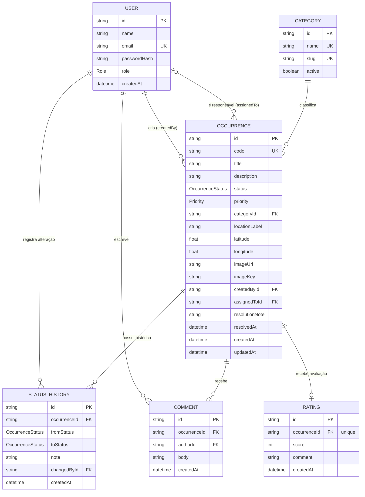

# DER — Modelo de dados

Diagrama entidade-relacionamento do schema Prisma (`prisma/schema.prisma`).

## Entidades

- **User** — conta de acesso ao sistema. `role` distingue `SOLICITANTE` (mora/usa o
  condomínio, abre ocorrências) de `GESTOR` (síndico/equipe administrativa, trata as
  ocorrências). Um mesmo usuário pode ter criado várias ocorrências e ser responsável
  por outras (duas relações nomeadas distintas com `Occurrence`).
- **Category** — categoria de facilities/condomínio (Elétrica, Hidráulica, Segurança,
  etc.) usada para classificar ocorrências; pode ser desativada (`active`) sem apagar
  o histórico já vinculado a ela.
- **Occurrence** — a ocorrência em si: um problema reportado, com título, descrição,
  localização em texto livre, prioridade e status corrente. Guarda o protocolo
  (`code`, formato `OC-2026-000123`), quem criou, quem está atendendo, e — quando
  resolvida — a nota de resolução e a data de resolução.
- **StatusHistory** — trilha de auditoria de cada mudança de status de uma ocorrência.
  O primeiro registro de toda ocorrência tem `fromStatus = null` (criação); daí em
  diante cada transição gera uma nova entrada com o status anterior, o novo status,
  quem alterou e uma observação opcional. Cascata: apagar a ocorrência apaga seu
  histórico.
- **Comment** — comentários trocados na ocorrência entre o solicitante dono e a
  equipe gestora, usados para acompanhamento sem alterar o status.
- **Rating** — avaliação (1 a 5) que o solicitante deixa depois que sua ocorrência é
  marcada como `RESOLVIDA`; relação 1-para-1 com `Occurrence` (`occurrenceId` é
  único).
